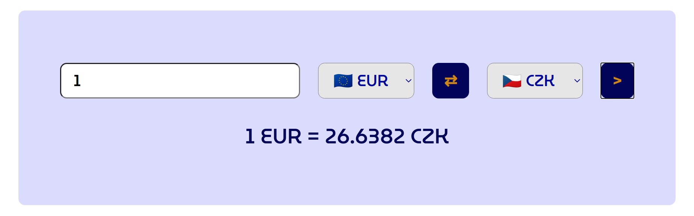

 <h1> </h1>

## Description

Small project that was done during my web development course just after learning arrays. A little bit utilized after learning about objects. Basic currency converter with static exchange rates (no API used for this) but possibility to change direction of the conversion.

## Implementation

**Used technologies**: Vanilla JS, DOM, array destructuring, HTML, CSS, CSS variables

In the code is defined object with exchange rates to USD. When the currency are selected, the values of the exchange rates are saved as well as the amount that want to be exchange and the final value is calculated basically using proportions.

Direction of the conversion is made by exchange of the values of both select inputs. I did it using by array destructuring, so I did not need to use some temporary variable for this purpose.
